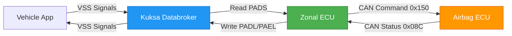
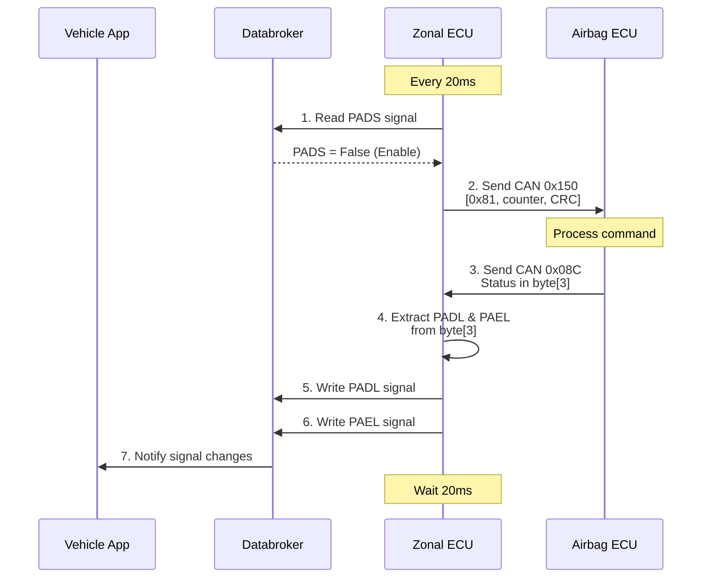
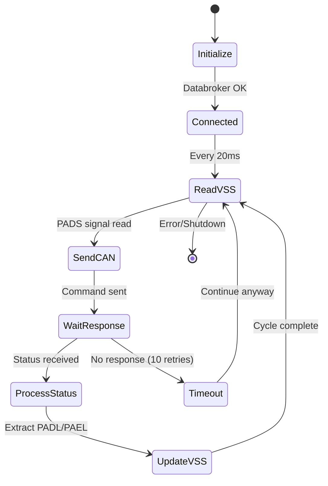

# 🏗️ Zonal ECU System Architecture

## 📋 Tổng quan

**Zonal ECU** đóng vai trò là **cầu nối (bridge)** giữa:
- **VSS (Vehicle Signal Specification)** - Hệ thống tín hiệu xe thông qua Kuksa Databroker
- **CAN Bus** - Giao tiếp với Airbag ECU qua CAN FD

---

## 🔄 Luồng hoạt động tổng thể



---

## 📡 VSS Signals (Vehicle Signal Specification)

### 1. **PADS** - Passenger Airbag Deactivated Status (INPUT)
```python
PADS_VSS_SIGNAL = 'Vehicle.Cabin.Light.Spotlight.Row1.PassengerSide.IsLightOn'
```

**Mục đích**: Nhận lệnh từ Vehicle App về trạng thái airbag

| Giá trị | Ý nghĩa | Hành động |
|---------|---------|-----------|
| `True` | Airbag đang bị vô hiệu hóa | Gửi lệnh DISABLE (0x80) |
| `False` | Airbag đang được kích hoạt | Gửi lệnh ENABLE (0x81) |

**Đọc từ VSS**:
```python
# Line 101 trong zonal_app.py
is_disabled = self.client.get_current_values([self.PADS_VSS_SIGNAL])
enable_airbag = not bool(is_disabled[self.PADS_VSS_SIGNAL].value)
```

---

### 2. **PADL** - Passenger Airbag Disable Lamp (OUTPUT)
```python
PADL_VSS_SIGNAL = 'Vehicle.Cabin.Seat.Row1.PassengerSide.Airbag.IsDeployed'
```

**Mục đích**: Thông báo trạng thái đèn "Airbag Disable" trên dashboard

| Giá trị | Ý nghĩa | Hiển thị trên HMI |
|---------|---------|-------------------|
| `1` (True) | Đèn DISABLE bật | 🔴 Airbag OFF |
| `0` (False) | Đèn DISABLE tắt | ⚫ (không hiển thị) |

**Ghi vào VSS**:
```python
# Line 66 trong zonal_app.py
self.client.set_current_values({
    self.PADL_VSS_SIGNAL: Datapoint(bool(self.PADL_data))
})
```

---

### 3. **PAEL** - Passenger Airbag Enable Lamp (OUTPUT)
```python
PAEL_VSS_SIGNAL = 'Vehicle.Cabin.Seat.Row1.PassengerSide.AirbagIndicator.AirbagIsEnable.IsSignaling'
```

**Mục đích**: Thông báo trạng thái đèn "Airbag Enable" trên dashboard

| Giá trị | Ý nghĩa | Hiển thị trên HMI |
|---------|---------|-------------------|
| `1` (True) | Đèn ENABLE bật | 🟢 Airbag ON |
| `0` (False) | Đèn ENABLE tắt | ⚫ (không hiển thị) |

**Ghi vào VSS**:
```python
# Line 76 trong zonal_app.py
self.client.set_current_values({
    self.PAEL_VSS_SIGNAL: Datapoint(bool(self.PAEL_data))
})
```

---

## 🚗 CAN Messages

### CAN Configuration
- **Protocol**: CAN FD (Flexible Data-rate)
- **Arbitration Bitrate**: 500 kbps
- **Data Bitrate**: 2 Mbps
- **Mode**: ISO CAN FD
- **Channels**: 
  - **CAN0**: Gửi lệnh và nhận status
  - **CAN1**: Loopback mode (test)

---

### 1. **CAN Command Message** (Zonal → Airbag ECU)

**CAN ID**: `0x150` (336 decimal)

**Format**:
```
┌─────────┬──────────────┬──────────┐
│ Byte 0  │   Byte 1     │  Byte 2  │
├─────────┼──────────────┼──────────┤
│ Command │ Alive Counter│ Checksum │
└─────────┴──────────────┴──────────┘
```

**Chi tiết từng byte**:

| Byte | Tên | Giá trị | Mô tả |
|------|-----|---------|-------|
| 0 | Command | `0x80` (128) | **DISABLE** passenger airbag |
| | | `0x81` (129) | **ENABLE** passenger airbag |
| 1 | Alive Counter | `0x00` - `0x0E` | Rolling counter (0-14), tăng mỗi lần gửi |
| 2 | Checksum | Calculated | CRC checksum (Profile1 algorithm) |

**Ví dụ**:
```python
# DISABLE airbag, counter = 5
Data: [0x80, 0x05, 0xXX]  # XX = checksum

# ENABLE airbag, counter = 6
Data: [0x81, 0x06, 0xXX]  # XX = checksum
```

**Gửi message**:
```python
# Line 298-327 trong can_driver.py
def send_airbag_command(self, enable_airbag):
    # Set command
    self.frame.frame.data[0] = 129 if enable_airbag else 128
    
    # Update alive counter (0-14)
    self.aliveCounter = (self.aliveCounter + 1) % 15
    self.frame.frame.data[1] = self.aliveCounter
    
    # Calculate checksum
    self.frame.frame.data[2] = cal_check_sum(self.frame.frame.data)
    
    # Send via CAN0
    result = self.canDLL.ZCAN_TransmitFD(self.dev_ch1, byref(self.frame), 1)
```

**Tần suất gửi**: Mỗi **20ms** (50 Hz)

---

### 2. **CAN Status Message** (Airbag ECU → Zonal)

**CAN ID**: `0x08C` (140 decimal)

**Format**:
```
┌────────┬────────┬────────┬────────┬────────┬────────┬────────┬────────┐
│ Byte 0 │ Byte 1 │ Byte 2 │ Byte 3 │ Byte 4 │ Byte 5 │ Byte 6 │ Byte 7 │
├────────┼────────┼────────┼────────┼────────┼────────┼────────┼────────┤
│   -    │   -    │   -    │ Status │   -    │   -    │   -    │   -    │
└────────┴────────┴────────┴────────┴────────┴────────┴────────┴────────┘
```

**Byte 3 - Status Byte** (bit mapping):
```
Bit:  7  6  5  4  3  2  1  0
      ─  ─  ─  ─  ─  ─  ─  ─
                 │  │
                 │  └─ Bit 2: PAEL (Enable Lamp)
                 └──── Bit 3: PADL (Disable Lamp)
```

**Giải mã**:
```python
# Line 399-400 trong can_driver.py
padl_status = (data[3] & 0b00001000) >> 3  # Bit 3
pael_status = (data[3] & 0b00000100) >> 2  # Bit 2
```

**Ví dụ**:
```python
# Airbag DISABLED
data[3] = 0b00001000  # PADL=1, PAEL=0
# → Đèn "Airbag OFF" bật

# Airbag ENABLED
data[3] = 0b00000100  # PADL=0, PAEL=1
# → Đèn "Airbag ON" bật
```

**Nhận message**:
```python
# Line 376-403 trong can_driver.py
def receive_airbag_status(self):
    # Get messages from CAN0
    ret = self.canDLL.ZCAN_GetReceiveNum(self.dev_ch1, TYPE_CANFD)
    rcv_msgs = (ZCAN_ReceiveFD_Data * ret)()
    num = self.canDLL.ZCAN_ReceiveFD(self.dev_ch1, byref(rcv_msgs), ret, 100)
    
    # Process each message
    for i in range(num):
        if rcv_msgs[i].frame.can_id == CAN_ID_AIRBAG_RESPONSE:
            data = rcv_msgs[i].frame.data
            padl_status = (data[3] & 0b00001000) >> 3
            pael_status = (data[3] & 0b00000100) >> 2
            return True, padl_status, pael_status
```

---

## ⏱️ Timing và Sequence

### Main Loop (20ms cycle)



### Timing Details

| Step | Thời gian | Mô tả |
|------|-----------|-------|
| 1. Read VSS | ~1ms | Đọc PADS từ Databroker |
| 2. Send CAN | ~0.5ms | Gửi command qua CAN |
| 3. Wait response | ~10ms | Đợi Airbag ECU xử lý |
| 4. Process status | ~0.5ms | Giải mã CAN response |
| 5-6. Write VSS | ~1ms | Cập nhật PADL/PAEL |
| 7. Sleep | ~7ms | Delay để đạt chu kỳ 20ms |

**Total cycle**: **20ms** (50 Hz)

---

## 🔁 Loopback Mode

**Mục đích**: Test hệ thống mà không cần Airbag ECU thật

**Kích hoạt**:
```bash
docker run ... zonal_app -loopback=1 192.168.1.1:55555
```

**Hoạt động**:
1. Zonal gửi command qua **CAN0**
2. Loopback nhận command qua **CAN1**
3. Loopback mô phỏng Airbag ECU:
   - Nếu nhận `0x80` → Gửi lại status PADL=1, PAEL=0
   - Nếu nhận `0x81` → Gửi lại status PADL=0, PAEL=1
4. Zonal nhận response qua **CAN1**

```python
# Line 329-374 trong can_driver.py
def process_loopback(self):
    # Receive from CAN1
    rcv_msgs = self.canDLL.ZCAN_ReceiveFD(self.dev_ch2, ...)
    
    # Simulate ECU behavior
    if data[0] == 128:  # DISABLE command
        padl_data = 0x01  # Disable lamp ON
        pael_data = 0x00  # Enable lamp OFF
    elif data[0] == 129:  # ENABLE command
        padl_data = 0x00  # Disable lamp OFF
        pael_data = 0x01  # Enable lamp ON
    
    # Send simulated response back via CAN1
    response.frame.can_id = CAN_ID_AIRBAG_RESPONSE
    response.frame.data[3] = (padl_data << 3) | (pael_data << 2)
    self.canDLL.ZCAN_TransmitFD(self.dev_ch2, byref(response), 1)
```

---

## 📊 State Diagram



---

## 🎯 Ví dụ thực tế

### Scenario 1: Phát hiện trẻ em → Tắt airbag

```
1. Vehicle App phát hiện trẻ em trên ghế phụ
   └─> Set PADS = True (airbag should be disabled)

2. Databroker cập nhật PADS signal

3. Zonal ECU đọc PADS = True
   └─> enable_airbag = not True = False

4. Zonal gửi CAN message:
   CAN ID: 0x150
   Data: [0x80, 0x05, 0xXX]  # DISABLE command
         │     │     └─ Checksum
         │     └─ Alive counter
         └─ DISABLE (128)

5. Airbag ECU nhận lệnh và xử lý
   └─> Tắt airbag hành khách

6. Airbag ECU gửi status:
   CAN ID: 0x08C
   Data: [0x00, 0x00, 0x00, 0x08, ...]
                              │
                              └─ Bit 3=1 (PADL ON)

7. Zonal ECU nhận status:
   └─> PADL = 1, PAEL = 0

8. Zonal cập nhật VSS:
   └─> Set PADL_VSS_SIGNAL = True

9. Vehicle App nhận signal
   └─> Hiển thị đèn "🔴 Airbag OFF" trên dashboard
```

---

### Scenario 2: Không phát hiện trẻ em → Bật airbag

```
1. Vehicle App không phát hiện trẻ em
   └─> Set PADS = False (airbag should be enabled)

2. Zonal ECU đọc PADS = False
   └─> enable_airbag = not False = True

3. Zonal gửi CAN message:
   CAN ID: 0x150
   Data: [0x81, 0x06, 0xXX]  # ENABLE command
         │     │     └─ Checksum
         │     └─ Alive counter
         └─ ENABLE (129)

4. Airbag ECU kích hoạt airbag

5. Airbag ECU gửi status:
   CAN ID: 0x08C
   Data: [0x00, 0x00, 0x00, 0x04, ...]
                              │
                              └─ Bit 2=1 (PAEL ON)

6. Zonal ECU cập nhật VSS:
   └─> Set PAEL_VSS_SIGNAL = True

7. Dashboard hiển thị "🟢 Airbag ON"
```

---

## 🔧 Checksum Calculation

**Algorithm**: CRC Profile1

```python
def Crc_CalculateCRC_Profile1(data, length, init_value):
    crc_temp = init_value
    
    for i in range(length):
        crc_temp ^= data[i]
        for _ in range(8):
            crc_save = crc_temp
            crc_temp = (crc_temp << 1) & 0xFF
            
            if crc_save & 0x80:
                crc_temp ^= 0x1D  # Polynomial
    
    return crc_temp
```

**Input buffer**:
```python
# PID = 0x611D
localBuffer[0] = PID & 0xFF if (counter % 2 == 0) else (PID >> 8) & 0xFF
localBuffer[1] = command_byte  # 0x80 or 0x81
localBuffer[2] = alive_counter
```

---

## 📦 Docker Container Runtime

Khi chạy container:

```bash
docker run --rm -it \
  --device=/dev/bus/usb/001/006 \  # USB CAN adapter
  ghcr.io/username/zonal-ecu:latest \
  -loopback=0 \                     # Normal mode
  192.168.1.1:55555                 # Databroker address
```

**Container sẽ**:
1. ✅ Load CAN library (`libcontrolcanfd.so`)
2. ✅ Kết nối USB CAN adapter
3. ✅ Kết nối Kuksa Databroker
4. ✅ Bắt đầu main loop 20ms
5. ✅ Tương tác VSS ↔ CAN

---

## 🎓 Tóm tắt

| Thành phần | Input | Output | Tần suất |
|------------|-------|--------|----------|
| **VSS Read** | PADS signal | Enable/Disable command | 50 Hz |
| **CAN Send** | Command byte | CAN 0x150 message | 50 Hz |
| **CAN Receive** | CAN 0x08C message | PADL/PAEL status | Async |
| **VSS Write** | PADL/PAEL status | VSS signals | On change |

**Flow**: `Vehicle App → VSS → Zonal ECU → CAN → Airbag ECU → CAN → Zonal ECU → VSS → Vehicle App`

**Vai trò Zonal ECU**: **Protocol Translator** (VSS ↔ CAN)
